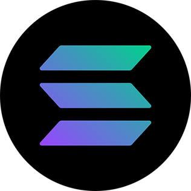

# The Solana Project in 2023

During 2023, the Solana blockchain has seen significant developments and improvements, marking its growing influence in the blockchain and cryptocurrency space. Here are some key aspects of its current status:

### Network Improvements and Performance:

Solana has implemented several network upgrades to enhance its performance, particularly in handling high traffic and demand. These upgrades include the introduction of QUIC, Stake Weighted Quality of Service (QoS), and localized fee markets. These changes have contributed to improved stability and efficiency, especially during periods of high stress, such as large NFT mints.

### Growth in Decentralized Applications (DApps) and Total Value Locked (TVL):

Solana's ecosystem has shown solid growth, with an increase in the usage of DApps and a 10% rise in DApps deposits. This growth is reflected in the total value locked in Solana's smart contracts, reversing a previous declining trend. Solana ranks as the fourth-largest blockchain in decentralized finance (DeFi) TVL and has seen a 28% growth in the number of active addresses.

### Price Surge and Innovation:

The past year has seen a significant surge in Solana's price, with an increase of nearly 90% in 30 days, including a 30% growth in the preceding week. This coincides with the launch of Solana's scaling solution, Firedancer, on the testnet, which has been met with positive market response.

### NFT Ecosystem Development:

The Solana NFT ecosystem has matured significantly. Projects are focusing on developing winning products before releasing NFT collections, a shift from previous practices. This maturity is evident in the premium placed on established projects and the success of collections like Claynosaurz, Famous Fox Federation, and Galactic Gecko Space Garage.

### Strategic Partnerships and Expansion:

Solana has formed strategic partnerships with various companies and organizations in the blockchain industry, aiding in expanding its reach and influence. The project aims to continue growing its platform, community, and influence in the DeFi and dApp sectors.

### Challenges and Future Goals:

Despite these advancements, Solana faces challenges such as matching the reliability of other major layer 1 blockchains like Ethereum. There are also concerns about its focus on speed and low fees potentially compromising decentralization. To address these, Solana plans to continue infrastructure upgrades, implement sharding for increased throughput, and work towards more decentralized governance.

### Regulatory Challenges:

Solana's SOL token has faced regulatory challenges, with the SEC designating it as a security. This has led to some platforms delisting the token. Despite this, Solana's stable network performance could lead to a rise in its price.

In summary, Solana in 2023 demonstrates significant growth, innovation, and improvement in network stability, positioning it as a major player in the blockchain space. However, it still faces challenges in terms of reliability and decentralization, which it aims to address through ongoing developments and strategic partnerships.
