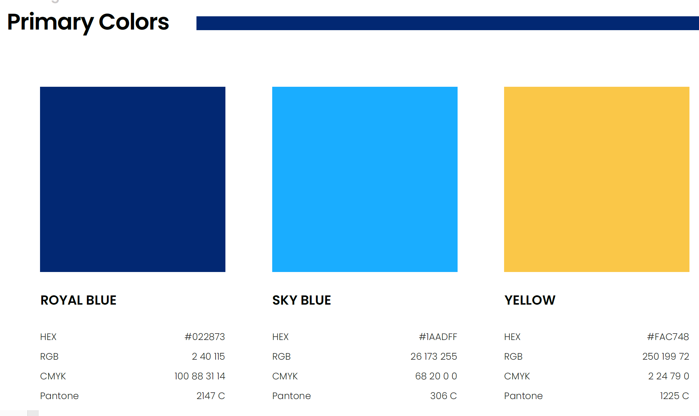

# CoinPort Video Production

The animated character we use for the videos is "Leonie Green". Leonie Green is a 30 year old professional woman.

## Video Specifications ##

### Youtube ###
For content with or without ads, YouTube does not set a minimum resolution but recommends a resolution of at least 1280x720 for video that has a 16:9 aspect ratio and a resolution of at least 640x480 for video that has a 4:3 aspect ratio.

### YouTube Shorts ###
1920 pixels by 1080 pixels
Upto 1 minute

Videos must be short in vertical orientation with a 9:16 aspect ratio and 1920 pixels by 1080 pixels resolution. You may use audio from YouTube's library or other videos for up to 60 seconds

### Tiktok ###
MP4 of WebM
720x1280 resulyion or higher
Upto 10 minutes
Less than 10Gb

| Description | Youtube | Shorts | Tiktok | Notes |
|-------------|---------|--------|--------|-------|
| Splash    |         |        |        |       |
|             |         |        |        |       |
|             |         |        |        |       |
|             |         |        |        |       |
|             |         |        |        |       |
|             |         |        |        |       |
|             |         |        |        |       |